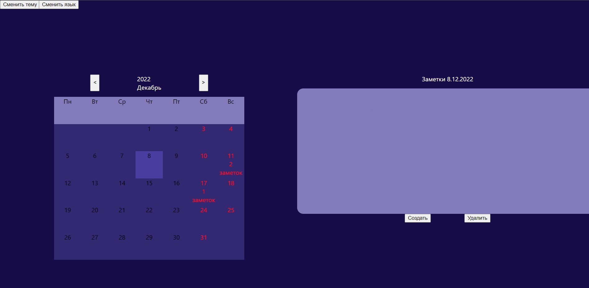
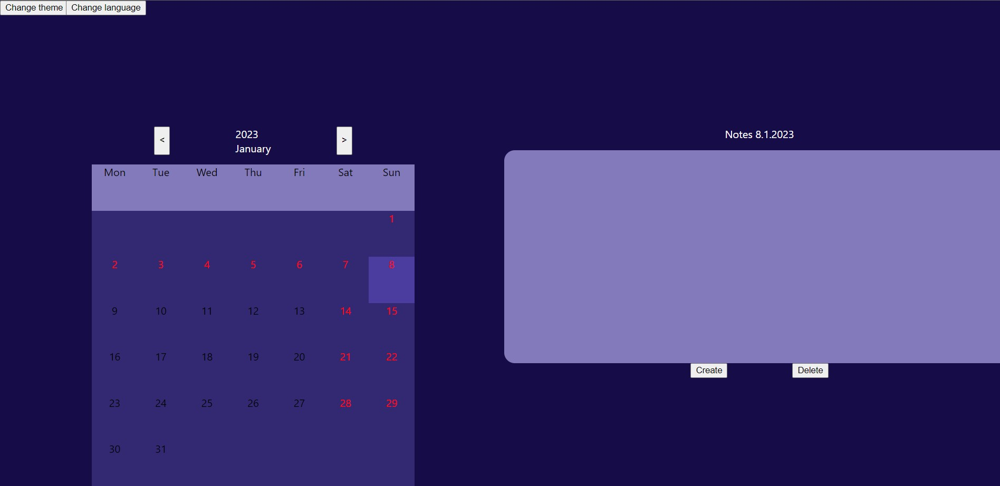
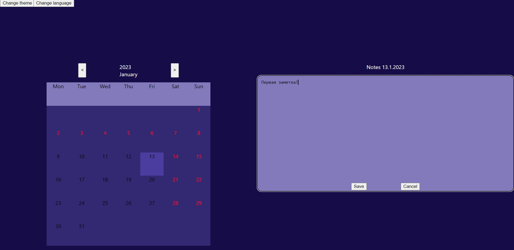
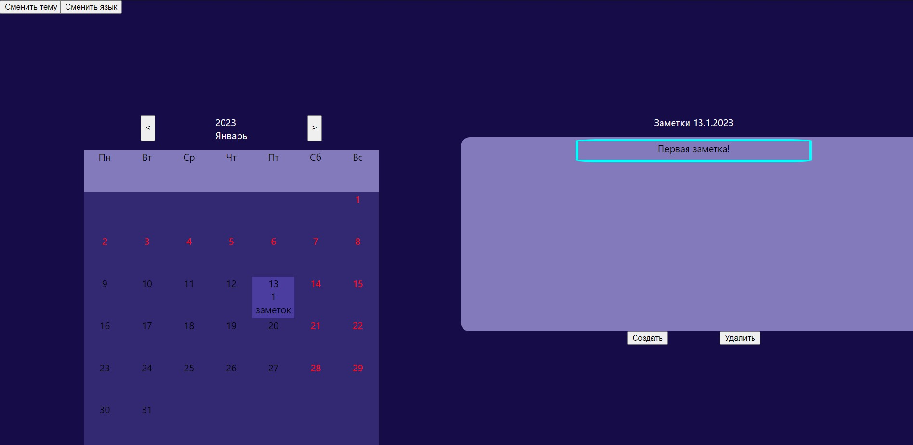
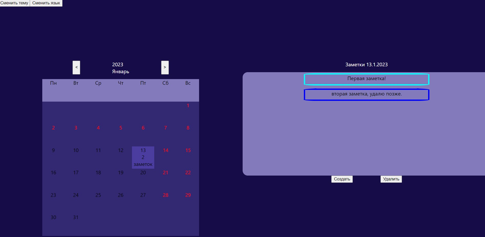

# Календарь с возможностью заметок

Учебный проект по курсу "Основы программной инжерении"

# Test results

<table>
  <tr>
    <th></th>
    <th>develop</th>
    <th>main</th>
  </tr>

  <tr>
    <td>
      Backend
    </td>
    <td>
      <a href="https://github.com/Stoncs/Calendar/actions/workflows/backend.yml?query=branch%3Adevelop">
        
      </a>
    </td>
    <td>
      <a href="https://github.com/Stoncs/Calendar/actions/workflows/backend.yml?query=branch%3Amain">
        
      </a>
    </td>
  </tr>

  <tr>
    <td>
      Frontend
    </td>
    <td>
      <a href="https://github.com/Stoncs/Calendar/actions/workflows/frontend.yml?query=branch%3Adevelop">
        
      </a>
    </td>
    <td>
      <a href="https://github.com/Stoncs/Calendar/actions/workflows/frontend.yml?query=branch%3Amain">
        
      </a>
    </td>
  </tr>
</table>

# Инструкция по запуску

В первом терминале:

```sh
git clone https://github.com/Stoncs/Calendar.git
cd Calendar/client
npm ci
npm start
```

Во втором терминале:

```sh
cd server
npm ci
node index.js
```

Готово, ваше приложение находится по адресу http://localhost:3000/

# Запуск с помощью Docker

```sh
git clone https://github.com/Stoncs/Calendar.git
docker compose up
```

# Инструкция по пользованию

Выберите дату. Нажмите создать заметку. Напишите задуманное. Сохраните. Вуа-ля, заметка сохранилась в базе данных. Теперь можете её просматривать всегда.

Ещё заметки можно удалять. Навсегда (без возможности восстановления).

# Пример использования

Вид приложения



Выбор даты



Создание заметки



Теперь её можно просматривать через календарь



Чтобы удалить заметку, кликните по ней и нажмите кнопку удалить.


